# Efficient360: Efficient Vision Transformer
The efficient 360 framework is a collection of transformer models in various dimensions.

[](https://arxiv.org/abs/2302.08374)

## Various Dimensions of Efficient360
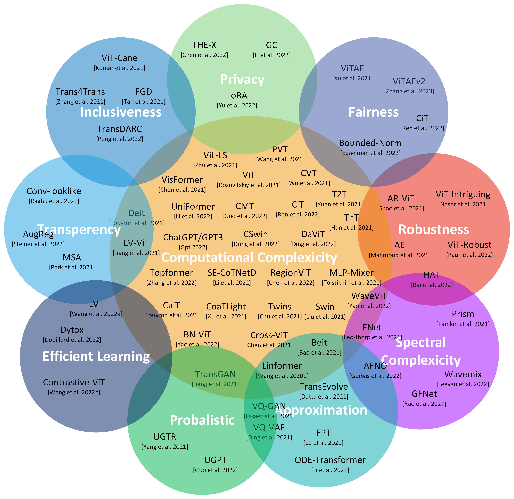 

## Vision Transformer Models and their comparisons.
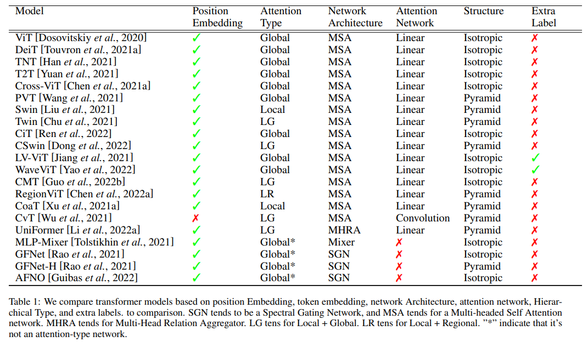 

## Inference on Deit-based transformer Model and its Grad-CAM Explanation
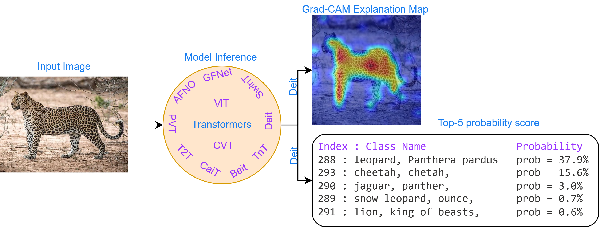 

## Architectural performance of Various Transformer Models
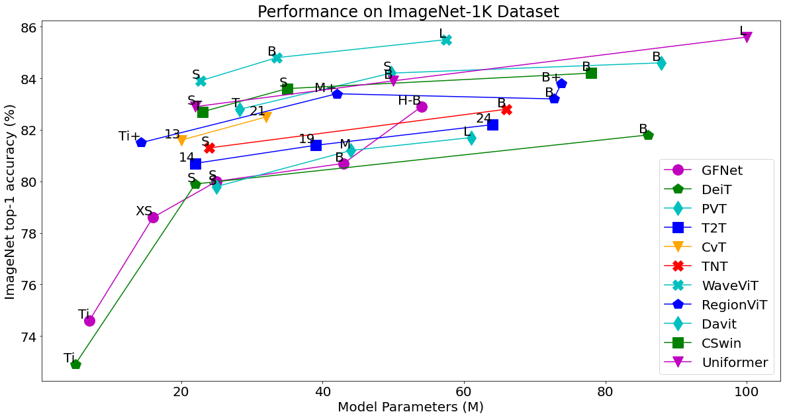 

## Architectural performance of Various SOTA Transformer Models
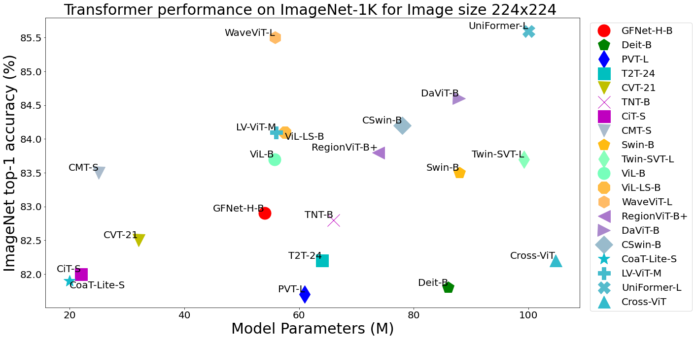


## State of the Art results of various vision transformer models on ImageNet-1K dataset with Image size 224 x 224.
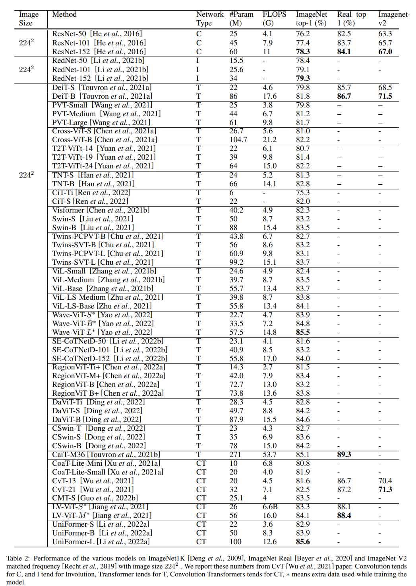 

## State of the Art results of various vision transformer models on ImageNet-1K dataset with different Image sizes.
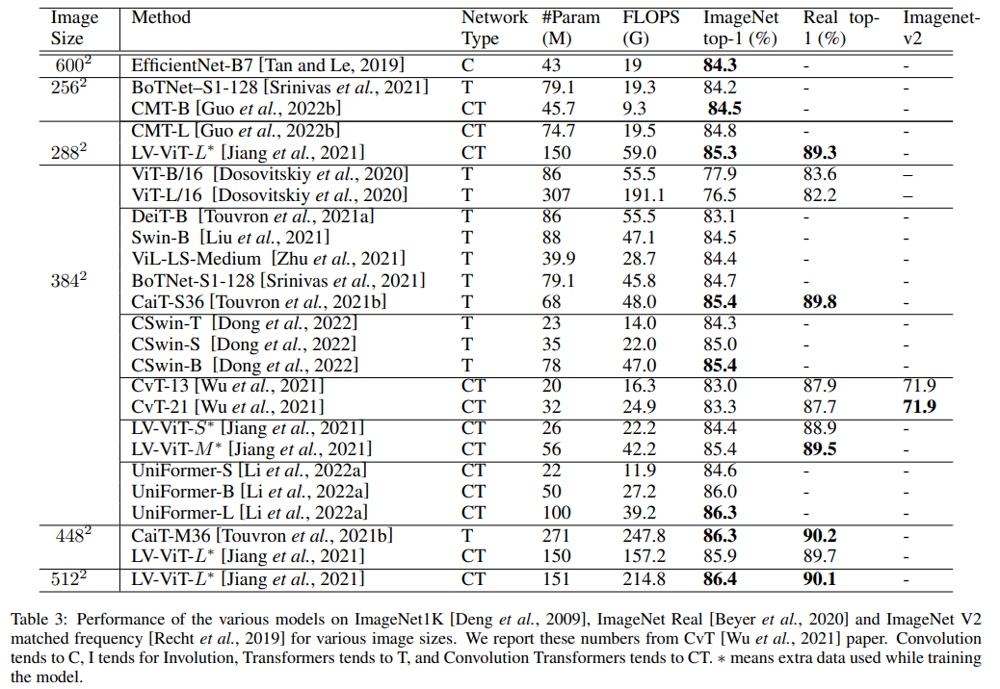 


## State of the Art results of various vision transformer models on ImageNet-22K dataset with different Image sizes.
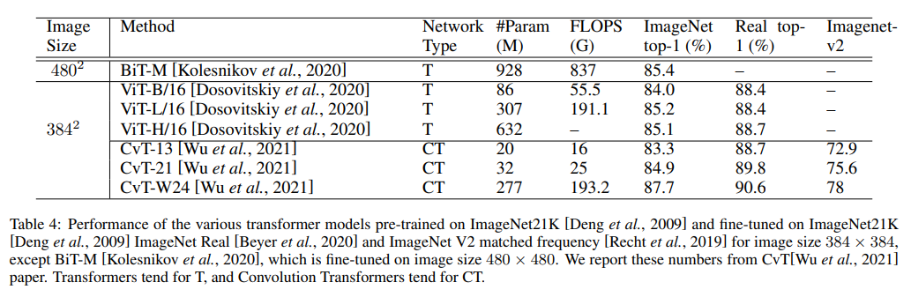 


## State of the Art results of various Spectral Vision Transformer models on ImageNet-1K dataset with different Image sizes.
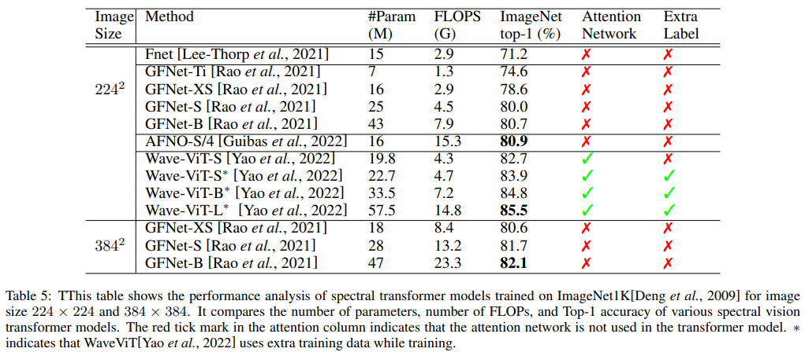 


 ## Transfer Learning results of various datasets like CIFAR10, CIFAR100, Pet, Flower, and Cars datasets, The models are  pre-trained on ImageNet-1K and ImageNet-22K datasets.
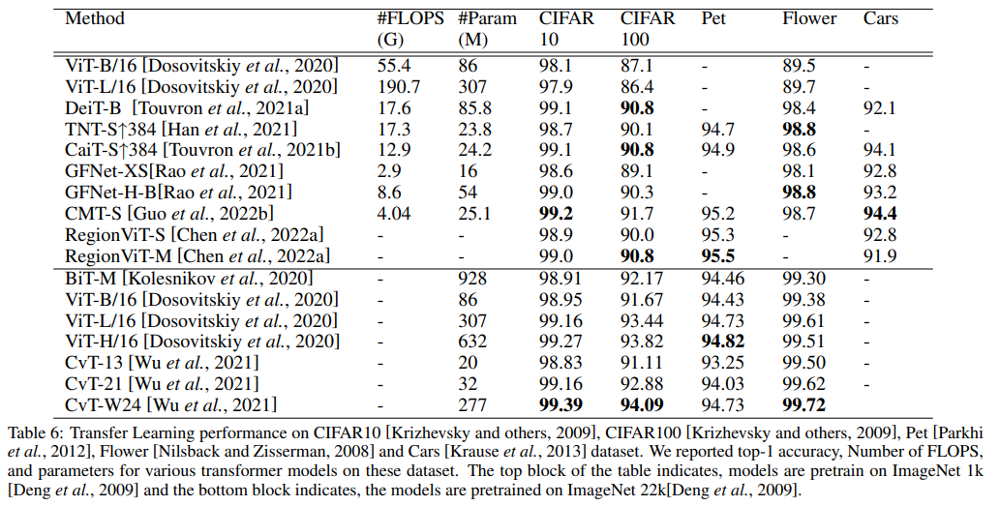 

 ## Long Range Arena (LRA) Benchmark Datasets  and its corresponding tasks.
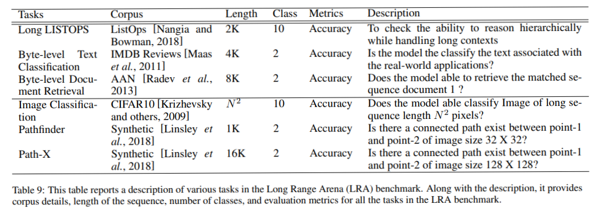


## Citation:
```

@article{efficient3602023,
  title={Efficient360: Efficient Vision Transformer},
  author={Patro, Badri N. and Agneeswaran Vijay S. },
  journal={arXiv preprint arXiv:2302.08374},
  year={2023}
}

```

## References:
[Bai et al., 2022] Jiawang Bai, Li Yuan, Shu-Tao Xia,Shuicheng Yan, Zhifeng Li, and Wei Liu. Improving vision transformers by revisiting high-frequency components. arXiv preprint arXiv:2204.00993, 2022.

[Bao et al., 2021] Hangbo Bao, Li Dong, Songhao Piao, and Furu Wei. Beit: Bert pre-training of image transformers.In International Conference on Learning Representations, 2021.

[Beltagy et al., 2020] Iz Beltagy, Matthew E Peters, and Arman Cohan. Longformer: The long-document transformer. arXiv preprint arXiv:2004.05150, 2020.

[Beyer et al., 2020] Lucas Beyer, Olivier J Henaff, Alexan-
der Kolesnikov, Xiaohua Zhai, and Aaron van den ¨Oord. Are we done with imagenet? arXiv preprint arXiv:2006.07159, 2020.

[Bhojanapalli et al., 2021] Srinadh Bhojanapalli, Ayan
Chakrabarti, Daniel Glasner, Daliang Li, Thomas Unterthiner, and Andreas Veit. Understanding robustness of transformers for image classification. In Proceedings of the IEEE/CVF International Conference on Computer
Vision, pages 10231–10241, 2021.

[Boemer et al., 2020] Fabian Boemer, Rosario Cammarota,Daniel Demmler, Thomas Schneider, and Hossein Yalame.
Mp2ml: A mixed-protocol machine learning framework for private inference. In Proceedings of the 15th International Conference on Availability, Reliability and Security, pages 1–10, 2020.

[Brock et al., 2021] Andy Brock, Soham De, Samuel L Smith, and Karen Simonyan. High-performance large-scale image recognition without normalization. In International Conference on Machine Learning, pages 1059–1071. PMLR, 2021.

[Chen et al., 2021a] Chun-Fu Richard Chen, Quanfu Fan, and Rameswar Panda. Crossvit: Cross-attention multi-scale vision transformer for image classification. In Proceedings of the IEEE/CVF international conference on computer vision, pages 357–366, 2021.

[Chen et al., 2021b] Zhengsu Chen, Lingxi Xie, Jianwei Niu, Xuefeng Liu, Longhui Wei, and Qi Tian. Visformer:
The vision-friendly transformer. In Proceedings of the IEEE/CVF International Conference on Computer Vision,
pages 589–598, 2021.

[Chen et al., 2022a] Chun-Fu Chen, Rameswar Panda, and Quanfu Fan. Regionvit: Regional-to-local attention for vision transformers. In International Conference on Learning Representations, 2022.

[Chen et al., 2022b] Tianyu Chen, Hangbo Bao, Shaohan Huang, Li Dong, Binxing Jiao, Daxin Jiang, Haoyi Zhou,
Jianxin Li, and Furu Wei. The-x: Privacy-preserving transformer inference with homomorphic encryption. In
Findings of the Association for Computational Linguistics: ACL 2022, pages 3510–3520, 2022.

[Child et al., 2019] Rewon Child, Scott Gray, Alec Radford, and Ilya Sutskever. Generating long sequences with sparse transformers. arXiv preprint arXiv:1904.10509, 2019.

[Choromanski et al., 2020] Krzysztof Marcin Choromanski, Valerii Likhosherstov, David Dohan, Xingyou Song, Andreea Gane, Tamas Sarlos, Peter Hawkins, Jared Quincy Davis, Afroz Mohiuddin, Lukasz Kaiser, et al. Rethinking
attention with performers. In International Conference on Learning Representations, 2020.

[Chu et al., 2021] Xiangxiang Chu, Zhi Tian, Yuqing Wang, Bo Zhang, Haibing Ren, Xiaolin Wei, Huaxia Xia, and
Chunhua Shen. Twins: Revisiting the design of spatial attention in vision transformers. Advances in Neural Information Processing Systems, 34:9355–9366, 2021.

[Deng et al., 2009] Jia Deng, Wei Dong, Richard Socher, LiJia Li, Kai Li, and Li Fei-Fei. Imagenet: A large-scale
hierarchical image database. In 2009 IEEE conference on computer vision and pattern recognition, pages 248–255.
Ieee, 2009.

[Ding et al., 2022] Mingyu Ding, Bin Xiao, Noel Codella, Ping Luo, Jingdong Wang, and Lu Yuan. Davit: Dual attention vision transformers. In Computer Vision–ECCV 2022: 17th European Conference, Tel Aviv, Israel, October 23–27, 2022, Proceedings, Part XXIV, pages 74–92. Springer, 2022.

[Dong et al., 2022] Xiaoyi Dong, Jianmin Bao, Dongdong Chen, Weiming Zhang, Nenghai Yu, Lu Yuan, Dong Chen,
and Baining Guo. Cswin transformer: A general vision transformer backbone with cross-shaped windows. In Proceedings of the IEEE/CVF Conference on Computer Vision and Pattern Recognition, pages 12124–12134, 2022.

[Dosovitskiy et al., 2020] Alexey Dosovitskiy, Lucas Beyer, Alexander Kolesnikov, Dirk Weissenborn, Xiaohua Zhai, Thomas Unterthiner, Mostafa Dehghani, Matthias Minderer, Georg Heigold, Sylvain Gelly, et al. An image is worth 16x16 words: Transformers for image recognition at scale. In International Conference on Learning Representations, 2020. 

[Douillard et al., 2022] Arthur Douillard, Alexandre Rame,´Guillaume Couairon, and Matthieu Cord. Dytox: Transformers for continual learning with dynamic token expansion. In Proceedings of the IEEE/CVF Conference on Computer Vision and Pattern Recognition, pages 9285–9295, 2022. 

[Dutta et al., 2021] Subhabrata Dutta, Tanya Gautam, Soumen Chakrabarti, and Tanmoy Chakraborty. Redesigning the transformer architecture with insights from multi-particle dynamical systems. Advances in Neural Information Processing Systems, 34:5531–5544, 2021.

[Edelman et al., 2022] Benjamin L Edelman, Surbhi Goel, Sham Kakade, and Cyril Zhang. Inductive biases and variable creation in self-attention mechanisms. In International Conference on Machine Learning, pages 5793–5831. PMLR, 2022.

[gpt, 2022] https://openai.com/blog/chatgpt/, 2022. 

[Guibas et al., 2022] John Guibas, Morteza Mardani, Zongyi Li, Andrew Tao, Anima Anandkumar, and Bryan Catanzaro. Efficient token mixing for transformers via adaptive fourier neural operators. In International Conference on Learning Representations, 2022.

[Guo et al., 2022a] Hongji Guo, Hanjing Wang, and Qiang Ji. Uncertainty-guided probabilistic transformer for complex action recognition. In Proceedings of the IEEE/CVF Conference on Computer Vision and Pattern Recognition, pages 20052–20061, 2022.

[Guo et al., 2022b] Jianyuan Guo, Kai Han, Han Wu, Yehui Tang, Xinghao Chen, Yunhe Wang, and Chang Xu. Cmt:Convolutional neural networks meet vision transformers. In Proceedings of the IEEE/CVF Conference on Computer Vision and Pattern Recognition, pages 12175–12185, 2022.

[Han et al., 2021] Kai Han, An Xiao, Enhua Wu, Jianyuan Guo, Chunjing Xu, and Yunhe Wang. Transformer in transformer. Advances in Neural Information Processing Systems, 34:15908–15919, 2021.

[He et al., 2016] Kaiming He, Xiangyu Zhang, Shaoqing Ren, and Jian Sun. Deep residual learning for image recognition. In Proceedings of the IEEE conference on computer vision and pattern recognition, pages 770–778, 2016.

[Hendrycks and Dietterich, 2018] Dan Hendrycks and Thomas Dietterich. Benchmarking neural network
robustness to common corruptions and perturbations. In International Conference on Learning  Representations, 2018.

[Huang et al., 2020] Yangsibo Huang, Zhao Song, Danqi Chen, Kai Li, and Sanjeev Arora. Texthide: Tackling data privacy in language understanding tasks. In Findings of the Association for Computational Linguistics: EMNLP 2020, pages 1368–1382, 2020.

[Jiang et al., 2021] Zi-Hang Jiang, Qibin Hou, Li Yuan, Daquan Zhou, Yujun Shi, Xiaojie Jin, Anran Wang, and Jiashi Feng. All tokens matter: Token labeling for training better vision transformers. Advances in Neural Information Processing Systems, 34:18590–18602, 2021.

[Katharopoulos et al., 2020] Angelos Katharopoulos, Apoorv Vyas, Nikolaos Pappas, and Franc¸ois Fleuret. Transformers are rnns: Fast autoregressive transformers with linear attention. In International Conference on Machine Learning, pages 5156–5165. PMLR, 2020.

[Kenton and Toutanova, 2019] Jacob Devlin MingWei Chang Kenton and Lee Kristina Toutanova. Bert:
Pre-training of deep bidirectional transformers for language understanding. In Proceedings of NAACL-HLT, pages 4171–4186, 2019.

[Kerrigan et al., 2020] Gavin Kerrigan, Dylan Slack, and Jens Tuyls. Differentially private language models benefit from public pre-training. In Proceedings of the Second Workshop on Privacy in NLP, pages 39–45, 2020.

[Kitaev et al., 2019] Nikita Kitaev, Lukasz Kaiser, and Anselm Levskaya. Reformer: The efficient transformer. In International Conference on Learning Representations, 2019.

[Kolesnikov et al., 2020] Alexander Kolesnikov, Lucas Beyer, Xiaohua Zhai, Joan Puigcerver, Jessica Yung, Sylvain Gelly, and Neil Houlsby. Big transfer (bit): General visual representation learning. In European conference on computer vision, pages 491–507. Springer, 2020.

[Krause et al., 2013] Jonathan Krause, Michael Stark, Jia Deng, and Li Fei-Fei. 3d object representations for fine-grained categorization. In Proceedings of the IEEE international conference on computer vision workshops, pages 554–561, 2013.

[Krizhevsky and others, 2009] Alex Krizhevsky et al. Learning multiple layers of features from tiny images. 2009.

[Kumar, 2021] Bhavesh Kumar. Vit cane: Visual assistant for the visually impaired. arXiv preprint
arXiv:2109.13857, 2021. 

[Lee-Thorp et al., 2021] James Lee-Thorp, Joshua Ainslie, Ilya Eckstein, and Santiago Ontanon. Fnet: Mixing tokens with fourier transforms. arXiv preprint arXiv:2105.03824, 2021.

[Li et al., 2020] Zongyi Li, Nikola Borislavov Kovachki, Kamyar Azizzadenesheli, Kaushik , Andrew
Stuart, Anima Anandkumar, et al. Fourier neural operator for parametric partial differential equations. In International Conference on Learning Representations, 2020.

[Li et al., 2021a] Bei Li, Quan Du, Tao Zhou, Shuhan Zhou, Xin Zeng, Tong Xiao, and Jingbo Zhu. Ode transformer: An ordinary differential equation-inspired model for neural machine translation. arXiv preprint arXiv:2104.02308, 2021.

[Li et al., 2021b] Duo Li, Jie Hu, Changhu Wang, Xiangtai Li, Qi She, Lei Zhu, Tong Zhang, and Qifeng Chen. Involution: Inverting the inherence of convolution for visual recognition. In Proceedings of the IEEE/CVF Conference on Computer Vision and Pattern Recognition, pages 12321–12330, 2021.

[Li et al., 2022a] Kunchang Li, Yali Wang, Junhao Zhang, Peng Gao, Guanglu Song, Yu Liu, Hongsheng Li, and Yu Qiao. Uniformer: Unifying convolution and self-attention for visual recognition. arXiv preprint arXiv:2201.09450, 2022.

[Li et al., 2022b] Yehao Li, Ting Yao, Yingwei Pan, and Tao Mei. Contextual transformer networks for visual recognition. IEEE Transactions on Pattern Analysis and Machine Intelligence, 2022.

[Linsley et al., 2018] Drew Linsley, Junkyung Kim, Vijay Veerabadran, Charles Windolf, and Thomas Serre. Learning long-range spatial dependencies with horizontal gated recurrent units. Advances in neural information processing systems, 31, 2018.
[Liu et al., 2021] Ze Liu, Yutong Lin, Yue Cao, Han Hu, Yixuan Wei, Zheng Zhang, Stephen Lin, and Baining Guo. Swin transformer: Hierarchical vision transformer using shifted windows. In Proceedings of the IEEE/CVF International Conference on Computer Vision, pages 10012–10022, 2021.

[Lu et al., 2021] Kevin Lu, Aditya Grover, Pieter Abbeel, and Igor Mordatch. Pretrained transformers as universal computation engines. arXiv preprint arXiv:2103.05247, 2021.

[Maas et al., 2011] Andrew Maas, Raymond E Daly, Peter T Pham, Dan Huang, Andrew Y Ng, and Christopher Potts. Learning word vectors for sentiment analysis. In Proceedings of the 49th annual meeting of the association for computational linguistics: Human language technologies,
pages 142–150, 2011.

[Nangia and Bowman, 2018] Nikita Nangia and Samuel Bowman. Listops: A diagnostic dataset for latent tree learning. In Proceedings of the 2018 Conference of the North American Chapter of the Association for Computational Linguistics: Student Research Workshop, pages 92–99, 2018.

[Nilsback and Zisserman, 2008] Maria-Elena Nilsback and Andrew Zisserman. Automated flower classification over a large number of classes. In 2008 Sixth Indian Conference on Computer Vision, Graphics & Image Processing, pages 722–729. IEEE, 2008.

[Park and Kim, 2021] Namuk Park and Songkuk Kim. How do vision transformers work? In International Conference on Learning Representations, 2021.

[Parkhi et al., 2012] Omkar M Parkhi, Andrea Vedaldi, Andrew Zisserman, and CV Jawahar. Cats and dogs. In 2012 IEEE conference on computer vision and pattern recognition, pages 3498–3505. IEEE, 2012.

[Paul and Chen, 2022] Sayak Paul and Pin-Yu Chen. Vision transformers are robust learners. In Proceedings of the AAAI Conference on Artificial Intelligence, volume 36,
pages 2071–2081, 2022.

[Peng et al., 2022] Kunyu Peng, Alina Roitberg, Kailun Yang, Jiaming Zhang, and Rainer Stiefelhagen. Transdarc: Transformer-based driver activity recognition with latent space feature calibration. In 2022 IEEE/RSJ International Conference on Intelligent Robots and Systems (IROS), pages 278–285. IEEE, 2022.

[Radev et al., 2013] Dragomir R Radev, Pradeep Muthukrishnan, Vahed Qazvinian, and Amjad Abu-Jbara. The acl anthology network corpus. Language Resources and Evaluation, 47(4):919–944, 2013.

[Radosavovic et al., 2020] Ilija Radosavovic, Raj Prateek Kosaraju, Ross Girshick, Kaiming He, and Piotr Dollar. ´ Designing network design spaces. In Proceedings of the IEEE/CVF conference on computer vision and pattern recognition, pages 10428–10436, 2020.

[Raghu et al., 2021] Maithra Raghu, Thomas Unterthiner, Simon Kornblith, Chiyuan Zhang, and Alexey Dosovitskiy. Do vision transformers see like convolutional neural networks? Advances in Neural Information Processing Systems, 34:12116–12128, 2021.

[Rao et al., 2021] Yongming Rao, Wenliang Zhao, Zheng Zhu, Jiwen Lu, and Jie Zhou. Global filter networks for image classification. Advances in Neural Information Processing Systems, 34:980–993, 2021.

[Recht et al., 2019] Benjamin Recht, Rebecca Roelofs, Ludwig Schmidt, and Vaishaal Shankar. Do imagenet classifiers generalize to imagenet? In International Conference on Machine Learning, pages 5389–5400. PMLR, 2019.

[Ren et al., 2022] Sucheng Ren, Zhengqi Gao, Tianyu Hua, Zihui Xue, Yonglong Tian, Shengfeng He, and Hang Zhao. Co-advise: Cross inductive bias distillation. In Proceedings of the IEEE/CVF Conference on Computer Vision and Pattern Recognition, pages 16773–16782, 2022.

[Ruthotto and Haber, 2020] Lars Ruthotto and Eldad Haber. Deep neural networks motivated by partial differential equations. Journal of Mathematical Imaging and Vision,
62(3):352–364, 2020.

[Sang and De Meulder, 2003] Erik Tjong Kim Sang and Fien De Meulder. Introduction to the conll-2003 shared task: Language-independent named entity recognition. In Proceedings of the Seventh Conference on Natural Language Learning at HLT-NAACL 2003, pages 142–147, 2003.

[Shao et al., 2021] Rulin Shao, Zhouxing Shi, Jinfeng Yi, Pin-Yu Chen, and Cho-Jui Hsieh. On the adversarial robustness of vision transformers. arXiv preprint arXiv:2103.15670, 2021.

[Srinivas et al., 2021] Aravind Srinivas, Tsung-Yi Lin, Niki Parmar, Jonathon Shlens, Pieter Abbeel, and Ashish Vaswani. Bottleneck transformers for visual recognition. In Proceedings of the IEEE/CVF conference on computer vision and pattern recognition, pages 16519–16529, 2021.

[Steiner et al., 2022] Andreas Peter Steiner, Alexander Kolesnikov, Xiaohua Zhai, Ross Wightman, Jakob Uszkoreit, and Lucas Beyer. How to train your vit? data, augmentation, and regularization in vision transformers. Transactions on Machine Learning Research, 2022. 

[Tan and Le, 2019] Mingxing Tan and Quoc Le. Efficientnet: Rethinking model scaling for convolutional neural networks. In International conference on machine learning, pages 6105–6114. PMLR, 2019.

[Tan et al., 2021] Haobin Tan, Chang Chen, Xinyu Luo, Jiaming Zhang, Constantin Seibold, Kailun Yang, and Rainer Stiefelhagen. Flying guide dog: Walkable path discovery for the visually impaired utilizing drones and transformer-based semantic segmentation. In 2021 IEEE International Conference on Robotics and Biomimetics (ROBIO), pages 1123–1128. IEEE, 2021.

[Tay et al., 2020a] Yi Tay, Dara Bahri, Liu Yang, Donald Metzler, and Da-Cheng Juan. Sparse sinkhorn attention. In International Conference on Machine Learning, pages 9438–9447. PMLR, 2020.

[Tay et al., 2020b] Yi Tay, Mostafa Dehghani, Samira Abnar, Yikang Shen, Dara Bahri, Philip Pham, Jinfeng Rao, Liu Yang, Sebastian Ruder, and Donald Metzler. Long range arena: A benchmark for efficient transformers. In International Conference on Learning Representations, 2020.

[Tay et al., 2020c] Yi Tay, Mostafa Dehghani, Dara Bahri, and Donald Metzler. Efficient transformers: A survey. ACM Computing Surveys (CSUR), 2020.

[Tay et al., 2021] Yi Tay, Dara Bahri, Donald Metzler, DaCheng Juan, Zhe Zhao, and Che Zheng. Synthesizer: Rethinking self-attention for transformer models. In International conference on machine learning, pages 10183–10192. PMLR, 2021.

[Tolstikhin et al., 2021] Ilya O Tolstikhin, Neil Houlsby, Alexander Kolesnikov, Lucas Beyer, Xiaohua Zhai, Thomas Unterthiner, Jessica Yung, Andreas Steiner, Daniel Keysers, Jakob Uszkoreit, et al. Mlp-mixer: An all-mlp architecture for vision. Advances in Neural Information Processing Systems, 34:24261–24272, 2021.

[Touvron et al., 2021a] Hugo Touvron, Matthieu Cord, Matthijs Douze, Francisco Massa, Alexandre Sablayrolles, and Herve J ´ egou. Training data-efficient image transformers & distillation through attention. In International Conference on Machine Learning, pages 10347–10357. PMLR, 2021.

[Touvron et al., 2021b] Hugo Touvron, Matthieu Cord, Alexandre Sablayrolles, Gabriel Synnaeve, and Herve´Jegou. Going deeper with image transformers. In ´Proceedings of the IEEE/CVF International Conference on Computer Vision, pages 32–42, 2021.

[Vaswani et al., 2017] Ashish Vaswani, Noam Shazeer, NikiParmar, Jakob Uszkoreit, Llion Jones, Aidan N Gomez, Łukasz Kaiser, and Illia Polosukhin. Attention is all you need. Advances in neural information processing systems,30, 2017.

[Wang et al., 2018] Alex Wang, Amanpreet Singh, Julian Michael, Felix Hill, Omer Levy, and Samuel R Bowman. Glue: A multi-task benchmark and analysis platform for natural language understanding. In International Conference on Learning Representations, 2018.

[Wang et al., 2020] Sinong Wang, Belinda Z Li, Madian Khabsa, Han Fang, and Hao Ma. Linformer: Self-attention with linear complexity. arXiv preprint arXiv:2006.04768, 2020.

[Wang et al., 2021] Wenhai Wang, Enze Xie, Xiang Li, Deng-Ping Fan, Kaitao Song, Ding Liang, Tong Lu, Ping Luo, and Ling Shao. Pyramid vision transformer: A versatile backbone for dense prediction without convolutions. In Proceedings of the IEEE/CVF International Conference on Computer Vision, pages 568–578, 2021.

[Wang et al., 2022a] Zhen Wang, Liu Liu, Yiqun Duan, Yajing Kong, and Dacheng Tao. Continual learning with lifelong vision transformer. In Proceedings of the IEEE/CVF Conference on Computer Vision and Pattern Recognition (CVPR), pages 171–181, June 2022.

[Wang et al., 2022b] Zhen Wang, Liu Liu, Yajing Kong, Jiaxian Guo, and Dacheng Tao. Online continual learning with contrastive vision transformer. In Computer Vision ECCV 2022: 17th European Conference, Tel Aviv, Israel, October 23–27, 2022, Proceedings, Part XX, pages 631–
650. Springer, 2022.

[Wu et al., 2021] Haiping Wu, Bin Xiao, Noel Codella, Mengchen Liu, Xiyang Dai, Lu Yuan, and Lei Zhang. Cvt: Introducing convolutions to vision transformers. In Proceedings of the IEEE/CVF International Conference on Computer Vision, pages 22–31, 2021.

[Wu et al., 2022] Boxi Wu, Jindong Gu, Zhifeng Li, Deng Cai, Xiaofei He, and Wei Liu. Towards efficient adversarial training on vision transformers. arXiv preprint arXiv:2207.10498, 2022.

[Xiong et al., 2021] Yunyang Xiong, Zhanpeng Zeng, Rudrasis Chakraborty, Mingxing Tan, Glenn Fung, Yin Li, and Vikas Singh. Nystromformer: A Nystrom-based ¨algorithm for approximating self-attention. In Proceedings of the AAAI Conference on Artificial Intelligence, volume 35, pages 14138–14148, 2021.

[Xu et al., 2021a] Weijian Xu, Yifan Xu, Tyler Chang, and Zhuowen Tu. Co-scale conv-attentional image transformers. In Proceedings of the IEEE/CVF International Conference on Computer Vision, pages 9981–9990, 2021.

[Xu et al., 2021b] Yufei Xu, Qiming Zhang, Jing Zhang, and Dacheng Tao. Vitae: Vision transformer advanced by exploring intrinsic inductive bias. Advances in Neural Information Processing Systems, 34:28522–28535, 2021.

[Yang et al., 2021] Fan Yang, Qiang Zhai, Xin Li, Rui Huang, Ao Luo, Hong Cheng, and Deng-Ping Fan.
Uncertainty-guided transformer reasoning for camouflaged object detection. In Proceedings of the IEEE/CVF International Conference on Computer Vision, pages 4146–4155, 2021.

[Yao et al., 2022] Ting Yao, Yingwei Pan, Yehao Li, ChongWah Ngo, and Tao Mei. Wave-vit: Unifying wavelet and transformers for visual representation learning. arXiv preprint arXiv:2207.04978, 2022.

[Yuan et al., 2021] Li Yuan, Yunpeng Chen, Tao Wang, Weihao Yu, Yujun Shi, Zi-Hang Jiang, Francis EH Tay, Jiashi Feng, and Shuicheng Yan. Tokens-to-token vit: Training vision transformers from scratch on imagenet. In Proceedings of the IEEE/CVF International Conference on Computer Vision, pages 558–567, 2021.

[Zaheer et al., 2020] Manzil Zaheer, Guru Guruganesh, Kumar Avinava Dubey, Joshua Ainslie, Chris Alberti, Santiago Ontanon, Philip Pham, Anirudh Ravula, Qifan Wang, Li Yang, et al. Big bird: Transformers for longer sequences. Advances in Neural Information Processing Systems, 33:17283–17297, 2020.

[Zhang et al., 2021a] Jiaming Zhang, Kailun Yang, Angela Constantinescu, Kunyu Peng, Karin Muller, and Rainer Stiefelhagen. Trans4trans: Efficient transformer for transparent object segmentation to help visually impaired people navigate in the real world. In Proceedings of the IEEE/CVF International Conference on Computer Vision, pages 1760–1770, 2021.

[Zhang et al., 2021b] Pengchuan Zhang, Xiyang Dai, Jianwei Yang, Bin Xiao, Lu Yuan, Lei Zhang, and Jianfeng Gao. Multi-scale vision longformer: A new vision transformer for high-resolution image encoding. In Proceedings of the IEEE/CVF International Conference on Computer Vision, pages 2998–3008, 2021.

[Zhang et al., 2022] Wenqiang Zhang, Zilong Huang, Guozhong Luo, Tao Chen, Xinggang Wang, Wenyu
Liu, Gang Yu, and Chunhua Shen. Topformer: Token pyramid transformer for mobile semantic segmentation. In Proceedings of the IEEE/CVF Conference on Computer Vision and Pattern Recognition, pages 12083–12093, 2022.

[Zhang et al., 2023] Qiming Zhang, Yufei Xu, Jing Zhang, and Dacheng Tao. Vitaev2: Vision transformer advanced by exploring inductive bias for image recognition and beyond. International Journal of Computer Vision, pages 1–22, 2023.

[Zhu et al., 2021] Chen Zhu, Wei Ping, Chaowei Xiao, Mohammad Shoeybi, Tom Goldstein, Anima Anandkumar, and Bryan Catanzaro. Long-short transformer: Efficient transformers for language and vision. Advances in Neural Information Processing Systems, 34:17723–17736, 2021

