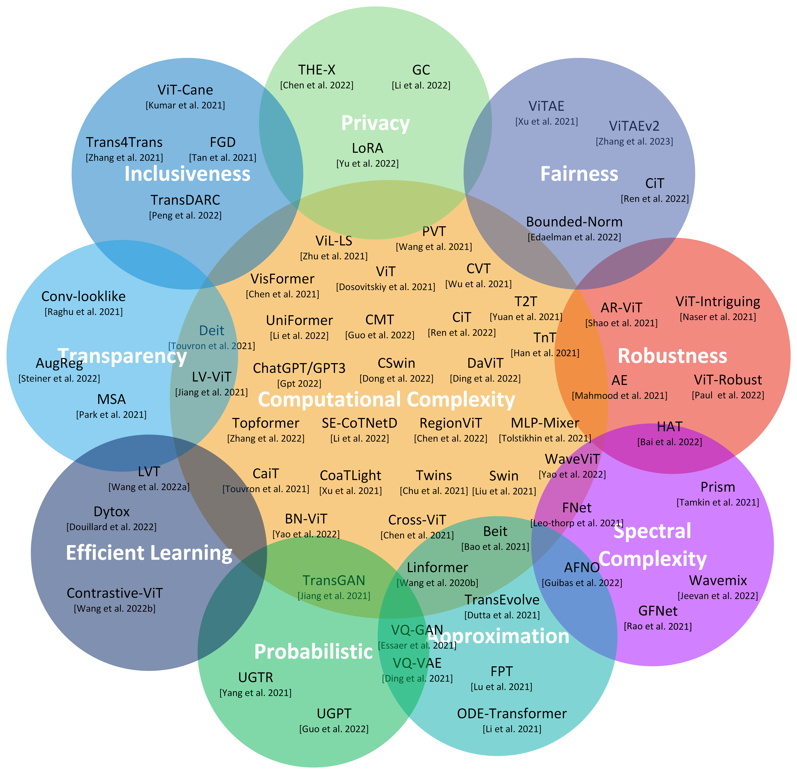

# Efficient360: Efficient Vision Transformer
The efficient 360 framework is a collection of transformer models in various dimensions.

## Various Dimensions of Efficient360
 

## Vision Transformer Models and their comparisons.
 

## Inference on Deit-based transformer Model and its Grad-CAM Explanation
 

## Architectural performance of Various Transformer Models
 

## Architectural performance of Various SOTA Transformer Models

## State of the Art results of various vision transformer models on ImageNet-1K dataset with Image size 224 x 224.
 

## State of the Art results of various vision transformer models on ImageNet-1K dataset with different Image sizes.
 

## State of the Art results of various vision transformer models on ImageNet-22K dataset with different Image sizes.
 

## State of the Art results of various Spectral Vision Transformer models on ImageNet-1K dataset with different Image sizes.
 

 ## Transfer Learning results of various datasets like CIFAR10, CIFAR100, Pet, Flower, and Cars datasets, The models are  pre-trained on ImageNet-1K and ImageNet-22K datasets.
 

 ## Long Range Arena (LRA) Benchmark Datasets  and its corresponding tasks.

